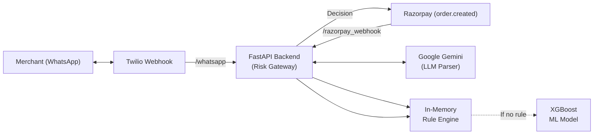

# Aegis: Autonomous Zero-UI Risk Operator

Aegis is a full-stack risk decision and communication gateway designed for Indian D2C merchants. It intercepts live payment gateway webhooks (e.g., Razorpay), evaluates transaction risk in milliseconds using a calibrated XGBoost model, and allows merchants to manage complex risk policies entirely through natural language via WhatsApp—without ever opening a dashboard.

> Aegis is a prototype for the Razorpay Buildathon. It acts as an enrichment and decision layer meant to sit seamlessly between the merchant and the payment gateway.

## Current capabilities

- **Zero-UI WhatsApp Management:** Merchants set, update, and pause risk rules entirely via conversational WhatsApp messages.
- **LLM-Powered Rule Extraction:** Uses Google Gemini to extract structured risk policies (Pydantic schemas) from natural language.
- **Deterministic Hard Rules Engine:** Instantly evaluates live checkouts against merchant-defined WhatsApp rules.
- **Calibrated ML Inference:** A pre-trained XGBoost model optimized via profit-curve thresholding (`0.71` threshold for malicious fraud).
- **Two-Bucket RTO Handling:** Mathematically distinguishes between casual returns (Bucket 1) and malicious fraud (Bucket 2) using device velocity and address fuzziness.
- **Dynamic Payment Routing:** Automatically downgrades risky COD (Cash-on-Delivery) orders to `REQUIRE_PREPAY` (UPI/Prepaid).
- **Graceful Fallbacks:** Built-in exponential backoff for LLM quotas, global Twilio webhook idempotency locks, and deterministic hardware kill-switches.
- **Interactive Judge Console:** A CLI tool to simulate live Razorpay checkouts, rule overrides, and bot attacks.

## Architecture



Aegis processes two distinct asynchronous flows: 
1. **The Control Plane:** Twilio webhooks hit `/whatsapp`, invoke Gemini, extract structured rules, and store them in memory.
2. **The Data Plane:** Razorpay webhooks hit `/razorpay_webhook`, get enriched, evaluate against hard rules, fallback to ML inference, and return a dynamic checkout decision.

## The Two-Bucket Loss Problem

60% of Indian e-commerce relies on Cash-on-Delivery (COD). High Return-to-Origin (RTO) rates typically consist of:
1. **Casual Returns:** Legitimate customers returning items. Blocking them destroys Customer Lifetime Value (LTV).
2. **Malicious Fraud:** Bad actors exploiting COD anonymity (high velocity, fuzzy addresses).

Aegis solves this by not conflating RTO with Fraud. The ML model requires malicious signals (velocity + fuzziness) to cross the `0.71` threshold. A high RTO history alone will not trigger a block, protecting merchant LTV.

## Technology stack

| Layer | Main technologies |
| --- | --- |
| **Backend** | Python 3.10+, FastAPI, Uvicorn, Pydantic, Requests |
| **Agent / LLM** | Google GenAI SDK (`gemini-flash-latest`), Twilio WhatsApp API |
| **Machine Learning** | XGBoost, Scikit-learn, Pandas, NumPy, Joblib |
| **Data Generation** | Faker, synthetic distribution modeling |

## Quick start

### Prerequisites
- Python 3.10+
- A Twilio Sandbox Account (for WhatsApp)
- Google Gemini API Key

### Installation

```bash
git clone https://github.com/Hardikgupta1709/aegis.git
cd aegis

# Create virtual environment
python -m venv venv
source venv/bin/activate

# Install dependencies
pip install fastapi uvicorn pandas numpy xgboost scikit-learn twilio google-genai requests
```

### Configuration

Set your environment variables:
```bash
export GEMINI_API_KEY="your_google_gemini_key"
```

### Run the Gateway

Start the FastAPI risk gateway on port 8000:
```bash
python serving/api.py
```

### Run the Judge Console

In a separate terminal, run the interactive checkout simulator to test the ML model and rule overrides:
```bash
python demo/judge_console.py
```

## API overview

| Route | Purpose |
| --- | --- |
| `POST /whatsapp` | Twilio webhook for ingesting merchant SMS/WhatsApp rules. Includes idempotency and kill-switch checks. |
| `POST /razorpay_webhook` | Razorpay `order.created` webhook. Evaluates risk and returns `allow_fast_track` or `require_prepay`. |
| `POST /evaluate_risk` | Internal direct ML scoring endpoint used by fairness and parity scripts. |

## Repository structure

```text
aegis/
├── agent/
│   ├── rule_parser.py       # Gemini LLM extraction and structured parsing
│   ├── test_rules.py        # Automated session isolation tests
│   └── digest_generator.py  # EOD insights and proactive rule generation
├── data/
│   ├── generate_data.py     # Synthetic Indian D2C data generator
│   └── synthetic_orders.csv # 100k+ row training dataset
├── demo/
│   ├── judge_console.py     # Interactive CLI for simulating checkouts
│   └── fairness_check.py    # Demographic parity and bias audit script
├── model/
│   ├── artifacts/           # Pickled XGBoost model and datasets
│   ├── train.py             # Model training, early stopping, and evaluation
│   └── profit_curve.ipynb   # Platt scaling and threshold optimization
├── serving/
│   └── api.py               # FastAPI risk gateway and Twilio endpoints
└── README.md
```

## Prototype boundaries and assumptions

- **Single-Worker State:** `MERCHANT_RULES` and Twilio idempotency locks are held in memory. Running this in production requires migrating state to a distributed layer like Redis.
- **Simulated Enrichment:** In production, Aegis acts as an enrichment layer, computing velocity and fuzziness server-side from raw checkout strings. For the demo, these signals are simulated inside the webhook `notes`.
- **Media Fallback:** Voice notes are on the roadmap. Currently, sending an audio/media file to the Twilio sandbox triggers a graceful "text only" fallback.
- **Rule Constraints:** The LLM parser extracts strict operator combinations (`>`, `<`, `==`). Highly abstract rules outside the Pydantic schema will trigger a conversational clarification.

## Team

Built for the Razorpay Buildathon.
- **Track:** AI Risk Manager
